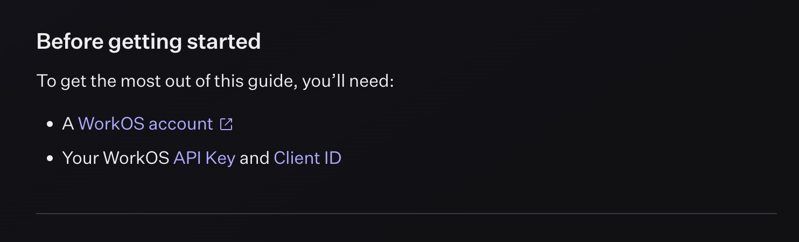
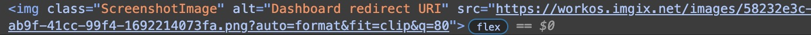
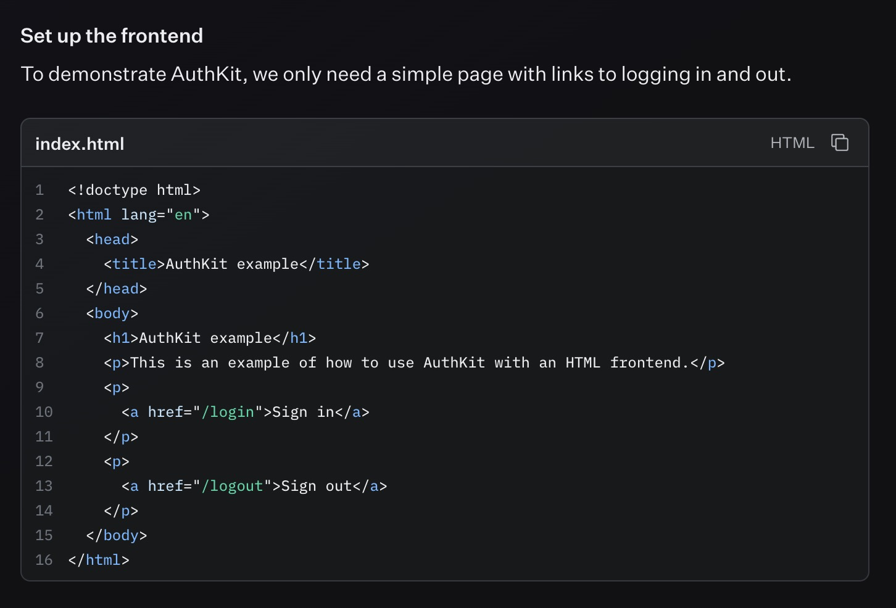
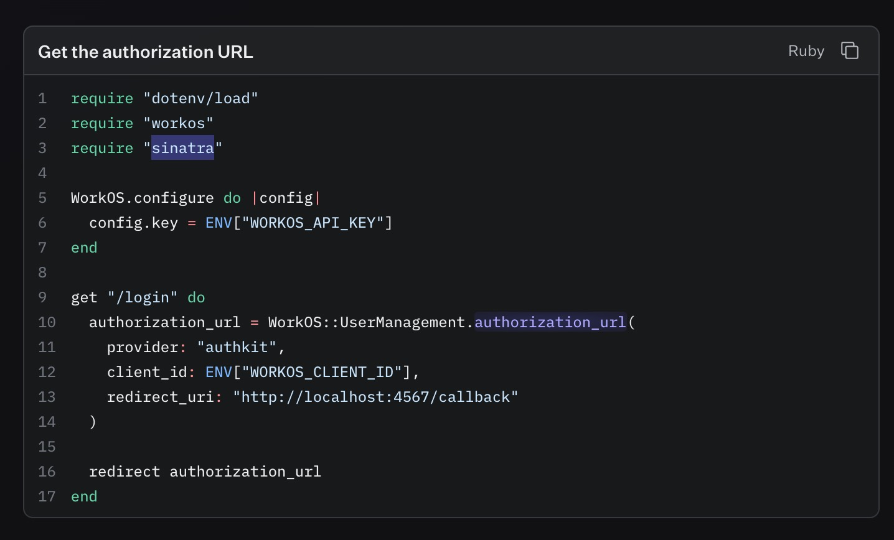
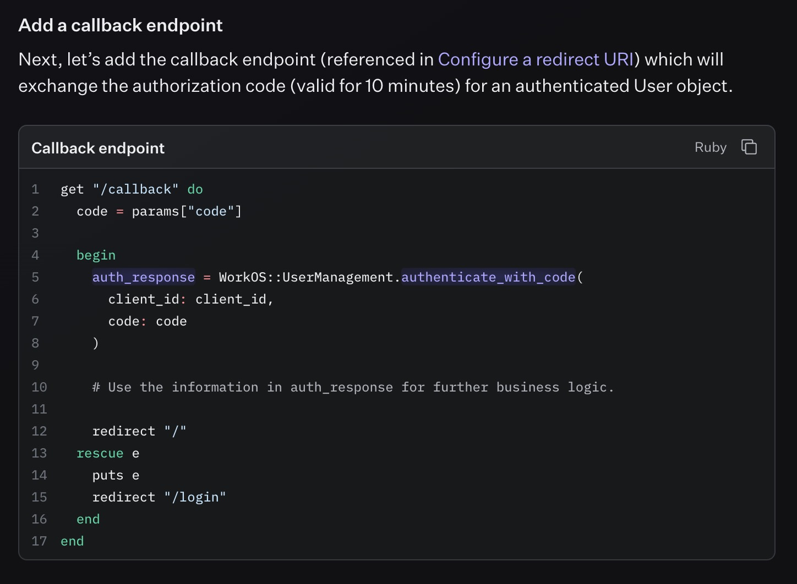

# 🔎 Authkit friction log

Hi WorkOS! My name is Shaun Evening and I'd like to welcome you to my submission for the Authkit Friction log.

To arrive at this structure, I went through the guide step-by-step, writing the accompanying app in this repo and taking notes as I went. Once I had a full working example, I reflected on the full experience and organized my thoughts by section.

I hope that you find this exercise useful and look forward to chatting about it during our scheduled time on Tuesday.

## The introduction

I really like how clear and concise this section was, with links to example apps for folks who get stuck. However, I would have expected to see examples for all the combinations available in the configure section of the page.

**💭 Suggestion:**
It would be nice to link to the specific example app for the chosen guide for users looking to follow along with a full reference.

I also really love that there's an "on this page" table of contents on the right-hand side to show you how much work there is to do.

**💭 Suggestion:**
Time estimates for each section could be helpful to show how quick it is to set up Authkit.

**💭 Suggestion:**
I think it's worth pointing out in the Before getting started section that this guide makes the assumption that you already have a fully functional app. Initially I picked the [Ruby + React guide](https://workos.com/docs/user-management/react/ruby) until I realized that the guide expected me to already have a working Sinatra app that served the React views as opposed to a separate React SPA. This led me to fallback to the [vanilla Ruby guide](https://workos.com/docs/user-management/vanilla/ruby) for the sake of the exercise.

## 1. Configure your project

**🤩 "Wow" moment:**
This section is fantastic! I love the buttons that let you configure the guide to your needs.

My only criticism here is that because they're all links instead of buttons, clicking on one jumps you to the top of the page. You can see the behavior in the gif below.

### Install dependencies

**💭 Suggestion:**
I noticed that some snippets have a copy button but the command to install the `workos` gem does not have one. This should be consistent, as copy buttons are helpful.

### Configure a redirect URI

This is another great section with inline links for more details on the user object and how wildcards work in the platform. I might have opted to have the dashboard link take the user directly to the redirects page to keep the user moving.

The picture of the suggested callback was pretty small and even after zooming in, I had to squint my eyes to see it. This is probably worth adding in the text. If it must remain an image, the text content should be provided in the alt text, so developers who rely on screen readers may benefit.

**🐞 Bug:**
Sinatra's default port is `4567` while the redirect uri example uses `3000`.

### Set secrets

**🤩 "Wow" moment:**
Rendering code snippets with logged in users’ actual staging key and client id is a brilliant piece of DX! This is a great way to reduce user friction during the guide.

**🔮 Far future idea:**
I believe I heard someone mention wanting to make a WorkOS CLI tool. If so, a helpful command could create a `.env` file or amend an existing one with these secrets.

## 2. Add Authkit to your app

### Set up the frontend

This is where I got lost. Presenting a React component labeled as `app.js` is confusing in the context of my experience with Ruby. I ended up coming to the conclusion that I would need to set up a way to have my Sinatra app serve SSR React views which felt out of scope for the purpose of this assignment. This led me to fall back on the default erb templating that Sinatra offers.

After making the switch to the vanilla ruby guide, I ended up grabbing the layout and index template files out of the [`ruby-authkit-example`](https://github.com/workos/ruby-authkit-example) repo to get back on track.

**💭 Suggestion:**
All snippets should include a filename, in either the title or as a code comment on the first line. The Ruby snippets’ use of the title to communicate the intent of the code made it hard to be confident where that code should be placed.

### Redirect users to authkit

This is the first time the guide mentions that we'll be using Sinatra as the ruby server which added to my confusion. The snippet makes me think that we're building the app from scratch, while the previous frontend section suggests that I have the views already figured out.

**💭 Suggestion:**
In the guide’s current state, I would move the frontend section to the end and include a snippet of the `/` path returning the home page view.

**💭 Suggestion:**
The second paragraph mentions the optional state parameter that's available. Adding a doc link to that information (as done for the user object earlier in the guide) would be a nice touch.

### Add callback endpoint

This is a good small step and I like that there's a copy button to grab the whole thing.

**🤩 "Wow" moment:**
This is also when I noticed that all the methods and variables for values related to WorkOS code are highlighted in the brand color. That's a nice, subtle touch.

## 3. Handle the user session

### Create a session password

**🐞 Bug:**
This was where the next big blocker hit me. In the guide, [it suggests I run `openssl rand -base64 64`](https://workos.com/docs/user-management/vanilla/ruby/3-handle-the-user-session/create-a-session-password) to get a 32 character string to use as the session password. I copy and pasted the result into my `.env` file thinking:

> Yup, that looks long enough to be 32 characters. Sweet, that was nice and easy.

_Record scratch... it was not 32 characters... it was 88 characters_

After some snooping around the other versions of the tutorial, I noticed that only the [Next](https://workos.com/docs/user-management/nextjs/1-configure-your-project/set-secrets) and [Remix](https://workos.com/docs/user-management/remix/1-configure-your-project/set-secrets) guides had the correct command of `openssl rand -base64 24`

I'm a little embarrassed by how long this took me to figure out, but hey, such is life, right?

**🔮 Far future idea:**
Going back to the CLI idea, generating a session password could be a quick and easy win to add to the `.env` file creation / appending idea above.

### Save the encrypted session

Great use of diff snippets here to add the session functionality into the previously defined callback route.

### Protected routes

I like that this step started with defining the `with_auth` helper.

**💭 Suggestion:**
Based on the rest of the guide, I would include the `load_session` helper that was used in the Ruby example app, as this functionality is used in multiple spots.

### Ending the session

No notes here other than the snippet title including the ruby file name as mentioned above.

### Validate the authentication flow

Due to me grabbing the `client_id` and `api_key` from the tutorial, I had never set up user management on my account. This meant that when I navigated to the Users page in the dashboard, I had to go through a set up flow before I made it to the users table shown in the screenshot.

**💭 Suggestion:**
Again, the inline link out to the dashboard is nice but I would link directly to the users page just to tighten up the experience.

## Up next

**💭 Suggestion:**
Linking to the page of example applications is a perfect next step in the getting started journey. To make it even better, the link could point to the example that fits the exact guide being viewed.

## Overall experience

This is a well considered guide with some really thoughtful DX sprinkled in that can be seriously lacking in non-JavaScript tooling guides.

My main recommendation is to refine who the audience is for the guide, what they should be familiar with, and how far along they should be with building their app when they arrive.

This was a really great interview exercise! I thoroughly enjoyed the experience and can't wait to talk about it soon.

All the best, 
Shaun Evening
